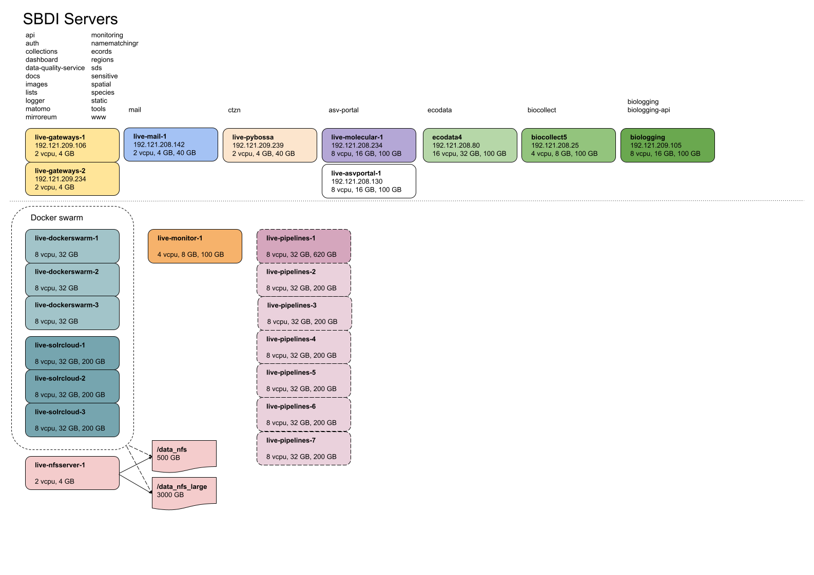
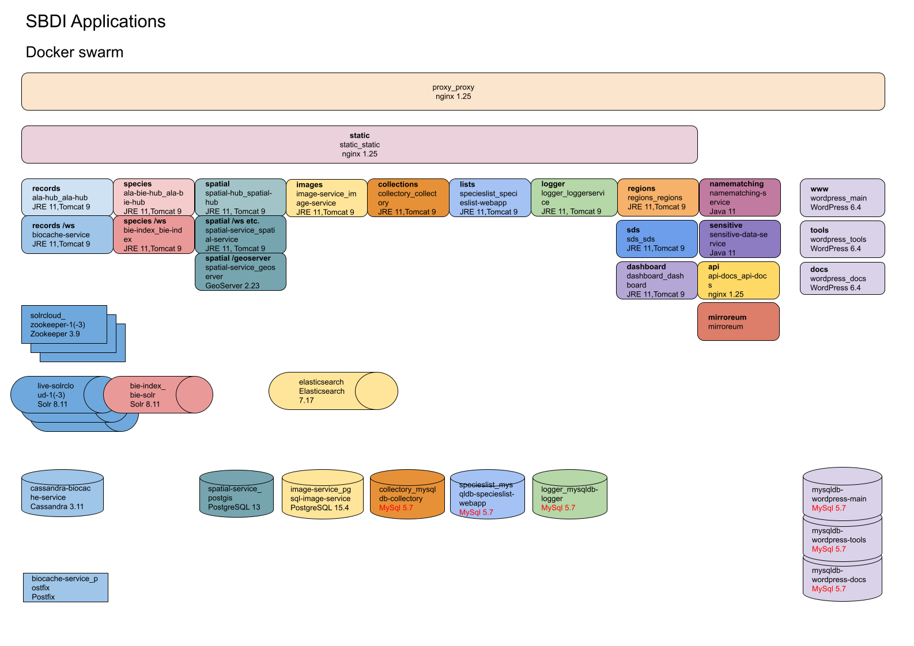
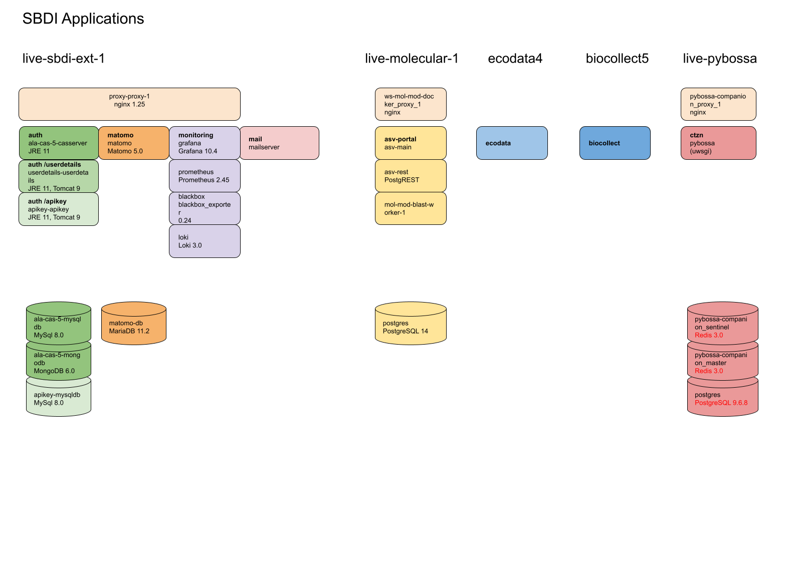

# Documentation overview
This document serves as a starting point for documentation of the SBDI system, services and applications managed by NRM (this can be expanded in the future).

More documentation can also be found in the [wiki](https://github.com/biodiversitydata-se/documentation-overview/wiki).

## Hosting
- Cloud servers are hosted by [Safespring](https://dashboard.sto1.safespring.com/) using [Openstack](https://www.openstack.org/).
- Domains (biodiversitydata.se plus a few more) are managed by [Loopia](https://www.loopia.se/loggain/).
- SSL/TLS Certificates are provided by Sectigo (through the IT department at NRM).
- Applications run in [Docker](https://www.docker.com/), the majority in a Docker Swarm setup consisting of several manager and worker nodes. Some applications run on separate servers.

### Server overview


### Application overview



## DevOps
Many devops tasks are automated using [Ansible](https://www.ansible.com/) and [Terraform](https://www.terraform.io/) and can be found, along with documentation, in the [sbdi-install](https://github.com/biodiversitydata-se/sbdi-install) repository.

This includes:
- Cloud server creation and management
- Application deployment
- Backups
- Monitoring
- and more

### Regular maintenance and checkup
- [System updates](https://github.com/biodiversitydata-se/documentation-overview/wiki/Running-system-updates-(apt))
- [General checkup](https://github.com/biodiversitydata-se/documentation-overview/wiki/General-checkup)
- [Monitoring](https://github.com/biodiversitydata-se/documentation-overview/wiki/Monitoring-maintenance)

## Applications
Most of the applications are forked from [ALA](https://github.com/AtlasOfLivingAustralia/). All of the forked repositories have an *sbdi* folder containing SBDI specific documentation and configuration. In most repositories there is also a GitHub issue called *SBDI modifications* which lists and describes the SBDI specific changes we have made to the code. The applications are built using [GitHub Actions](https://docs.github.com/en/actions) and published [as Docker images](https://github.com/orgs/biodiversitydata-se/packages). 

Follow these instructions when [updating an ALA fork](https://github.com/biodiversitydata-se/documentation-overview/wiki/Updating-an-ALA-fork-from-upstream).

[Bioatlas repos are listed here](https://github.com/biodiversitydata-se/repo-overview?tab=readme-ov-file#bioatlas). 

## Data
Datasets are published by the various data providers in the [GBIF Sweden IPT](https://www.gbif.se/ipt). Dataset meta data is synced from the IPT to the Atlas using the [Collectory](https://collections.biodiversitydata.se/). The occurrence records are then loaded into the Atlas using the [pipelines](https://github.com/biodiversitydata-se/pipelines) application. 

### Syncing datasets from IPT to Atlas
Dataset meta data is synced from the [IPT GBIF Sweden](https://collections.biodiversitydata.se/dataProvider/show/dp0) data provider page in the Collectory admin interface. Use the **Update data resources** button. 
To view differences between datasets in the IPT and the Atlas click **Compare IPT vs Atlas**.

#### Adding a new dataset
When a new dataset has been added to the IPT it will be created in the Atlas by the above sync procedure. However, it will require some additional configuration.

On the created Data resource:
- DOI
- Institution
- Resource type (if needed, defaults to `records`)
- Darwin core terms that uniquely identify a record (if other than `catalogNumber`)
- Default values for DwC fields (if needed)
- Record consumers - institution and collection (after you've created the collection)

Create a new Collection:
- Public description (copy from data resource)
- Contacts (copy from data resource)
- Provider codes - institution and collection (make sure these are present in occurrence.txt, otherwise add to *Default values for DwC fields* on the data resource)


### Loading records into the Atlas
The major steps are listed below, detailed documentation for data ingestion can be found in [the pipelines repository](https://github.com/biodiversitydata-se/pipelines/blob/master/sbdi/README.md) and in sbdi-install ([terraform](https://github.com/biodiversitydata-se/sbdi-install/blob/main/terraform) and [ansible](https://github.com/biodiversitydata-se/sbdi-install/blob/main/ansible/roles/pipelines/README.md)).

* Create and start the pipelines machines:
    ```
    ./utils/pipelines/startup.sh
    ```
    or  manually:
    * [Create the live-pipelines machines](https://github.com/biodiversitydata-se/sbdi-install/tree/main/terraform#running) using Terraform
    * Machine keys stored in `.ssh/known_hosts` (on your local machine) will have changed and need to be updated in order to connect to the machines:
        ```
        ansible-playbook -i inventories/prod pipelines_local_access.yml
        ```
    * Update machine keys for hadoop and spark users (on live-pipelines) and then start hadoop and spark:
        ```
        ansible-playbook -i inventories/prod pipelines.yml -t update_host_keys,start_cluster --ask-become-pass
        ```
* (Optional) To monitor the pipelines machines: uncomment live-pipelines in the `monitoring_target` section of the prod inventory. Deploy and restart Prometheus:
    ```
    ansible-playbook -i inventories/prod monitoring.yml -t observer --ask-become-pass
    ```
* [Run pipelines](https://github.com/biodiversitydata-se/pipelines/tree/master/sbdi#running-pipelines)
* Backup to NRM:
    ```
    ./utils/pipelines/backup-to-nrm.sh
    ```
    * or  manually: [Backup UUID:s and logs](https://github.com/biodiversitydata-se/pipelines/tree/master/sbdi#backup) to nrm-sbdibackup
* Remove the live-pipelines machines
    ```
    ./utils/pipelines/shutdown.sh
    ```
    * or using OpenStack API:
        ```
        openstack server stop live-pipelines-1 live-pipelines-2 live-pipelines-3 live-pipelines-4 live-pipelines-5 live-pipelines-6 live-pipelines-7
        ```
        ```
        openstack server delete live-pipelines-1 live-pipelines-2 live-pipelines-3 live-pipelines-4 live-pipelines-5 live-pipelines-6 live-pipelines-7
        ``` 
    * or manually in Safespring UI (*Shut Off Instance* followed by *Delete Instance*)
