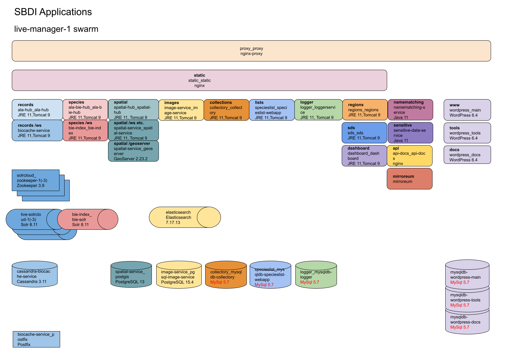

# Documentation overview

This document serves as a starting point for documentation of the SBDI system, services and applications managed by NRM (this can be expanded in the future). 

## Hosting
- Cloud servers are hosted by [Safespring](https://dashboard.sto1.safespring.com/) using [Openstack](https://www.openstack.org/).
- Domains (biodiversitydata.se plus a few more) are managed by [Loopia](https://www.loopia.se/loggain/).
- SSL/TLS Certificates are provided by Geant?
- Applications run in [Docker](https://www.docker.com/), the majority in a Docker Swarm setup consisting of several manager and worker nodes. Some applications run on separate servers.

### Application overview

## DevOps
Many devops tasks are automated using [Ansible](https://www.ansible.com/) and [Terraform](https://www.terraform.io/) and can be found, along with documentation, in the [sbdi-install](https://github.com/biodiversitydata-se/sbdi-install) repository.

This includes:
- Cloud server creation and management
- Application deployment
- Backups
- Monitoring
- and more

## Applications
 Most of the applications are forked from [ALA](https://github.com/AtlasOfLivingAustralia/). All of the forked repositories have an *sbdi* folder containing SBDI specific documentation and configuration. In most repositories there is also a GitHub issue called *SBDI modifications* which lists and describes the SBDI specific changes we have made to the code. The applications are built using [GitHub Actions](https://docs.github.com/en/actions) and published [as Docker images](https://github.com/orgs/biodiversitydata-se/packages).

ALA forks:
- [ala-bie-hub](https://github.com/biodiversitydata-se/ala-bie-hub)
- [ala-cas-5](https://github.com/biodiversitydata-se/ala-cas-5)
- [ala-hub](https://github.com/biodiversitydata-se/ala-hub)
- [ala-namematching-service](https://github.com/biodiversitydata-se/ala-namematching-service)
- [ala-sensitive-data-service](https://github.com/biodiversitydata-se/ala-sensitive-data-service)
- [apikey](https://github.com/biodiversitydata-se/apikey)
- [base-branding](https://github.com/biodiversitydata-se/base-branding)
- [bie-index](https://github.com/biodiversitydata-se/bie-index)
- [biocache-service](https://github.com/biodiversitydata-se/biocache-service)
- [collectory](https://github.com/biodiversitydata-se/collectory)
- [dashboard](https://github.com/biodiversitydata-se/dashboard)
- [data-quality-filter-service](https://github.com/biodiversitydata-se/data-quality-filter-service)
- [image-service](https://github.com/biodiversitydata-se/image-service)
- [logger-service](https://github.com/biodiversitydata-se/logger-service)
- [pipelines](https://github.com/biodiversitydata-se/pipelines)
- [regions](https://github.com/biodiversitydata-se/regions)
- [sds-webapp2](https://github.com/biodiversitydata-se/sds-webapp2)
- [spatial-hub](https://github.com/biodiversitydata-se/spatial-hub)
- [spatial-service](https://github.com/biodiversitydata-se/spatial-service)
- [specieslist-webapp](https://github.com/biodiversitydata-se/specieslist-webapp)
- [userdetails](https://github.com/biodiversitydata-se/userdetails)

Other:
- [api-docs](https://github.com/biodiversitydata-se/api-docs)
- [bie-solr](https://github.com/biodiversitydata-se/bie-solr)
- [biocache-solr](https://github.com/biodiversitydata-se/biocache-solr)
- [gbif-taxonomy-for-la](https://github.com/biodiversitydata-se/gbif-taxonomy-for-la)
- [geoserver](https://github.com/biodiversitydata-se/geoserver)
- [mirroreum](https://github.com/biodiversitydata-se/mirroreum)
- [sbdi4r2](https://github.com/biodiversitydata-se/sbdi4r2)
